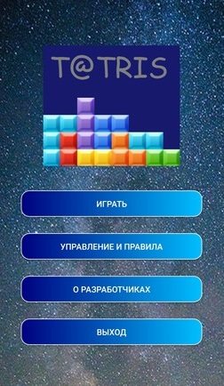

# game tetris


- [How To Install](#anc1)
- [How to Use](#anc2)
- [How To Contribute](#anc3)
- [Example of work](#anc4)

---
Game [Tetris](https://en.wikipedia.org/wiki/Minesweeper_(video_game)), which is implemented as android application.</br>
Realized with a [Java 8](https://www.oracle.com/ru/java/technologies/javase/javase8-archive-downloads.html).</br>

<a id="anc1"></a>

## How To Install
- The sources for application can be downloaded from the [Github repo](https://github.com/rrtty0/game_tetris.git).

* You can either clone the public repository:
```
        $ git clone https://github.com/rrtty0/game_tetris.git 
```

- The application is available via the [link](https://play.google.com/store/apps/details?id=msh_TETR.my_work.tetr_by_msh) at the [Google Play](https://play.google.com/store?hl=ru&gl=US)

<a id="anc2"></a>

## How to Use

- For use [this application](https://play.google.com/store/apps/details?id=msh_TETR.my_work.tetr_by_msh) you must download it at your mobile device. After this, you need to open downloaded appliction.

<a id="anc3"></a>

## How To Contribute
1. _Clone repo_ and _create a new branch_:
```
        $ git clone https://github.com/rrtty0/game_tetris.git
        $ git branch name_for_new_branch
        $ git checkout name_for_new_branch
```
2. _Make changes_ and _test_
3. _Submit Pull Request_ with comprehensive description of changes

<a id="anc4"></a>

## Example of work



---


---

